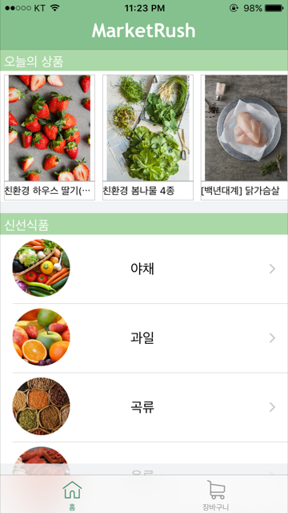
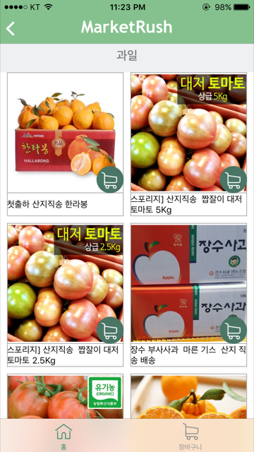
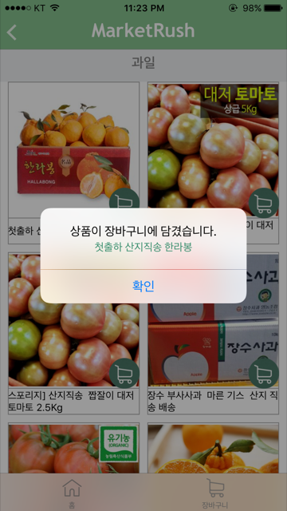
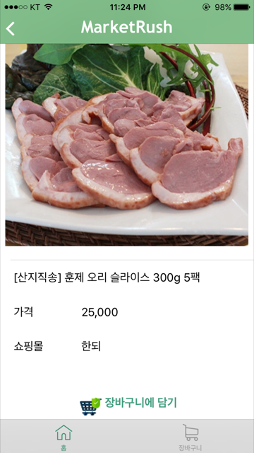
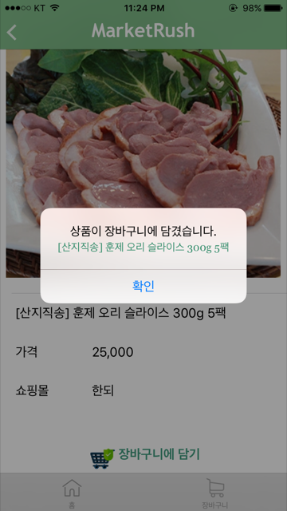
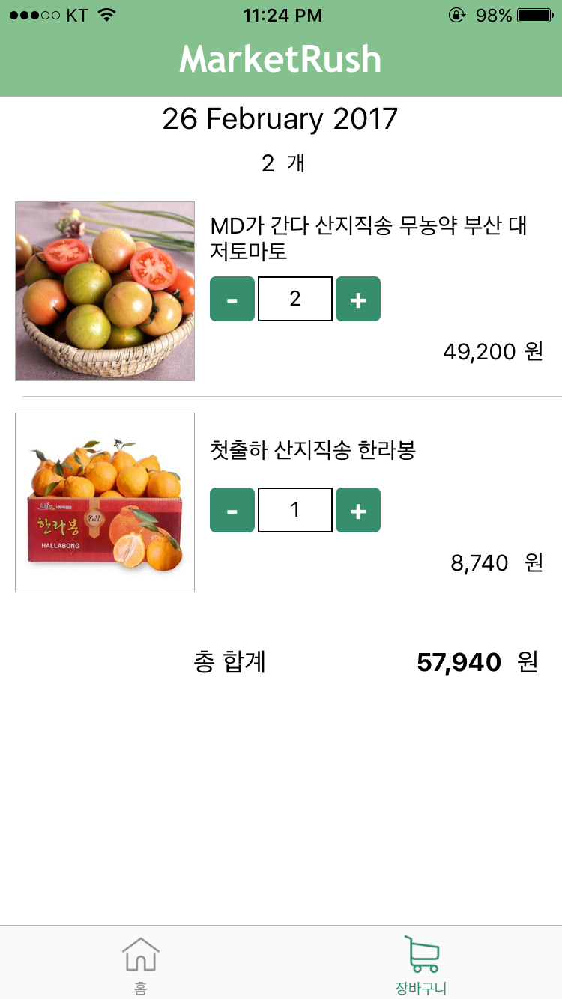

# MarketRush
####Simple e-commerce market iOS Application
---
## Getting Started
> Market Rush is a simple online market application including product search using Naver API and add/view shopping items.

---
## Screenshots
        
        

----
## Key Features
1. Search Products with simple category
2. Add items in cart
3. Manage and view added shopping items.

---
## Built With
* Realm DB: Storing User's Shopping List
* Alamofire: HTTP Response, JSON Parameter Encoding from NAVER Search API
* Alamofire-Object-Mappe: Convert Mapping JSON to objects
* MVC/Singleton Pattern

## Demo Video 

----
## Next Step
* Improve Search Tool based on User Experience 
* Add Push Notification Service for added items' stock information and reserved payment service
* Implement Server for User Login System and managing relevant information.
